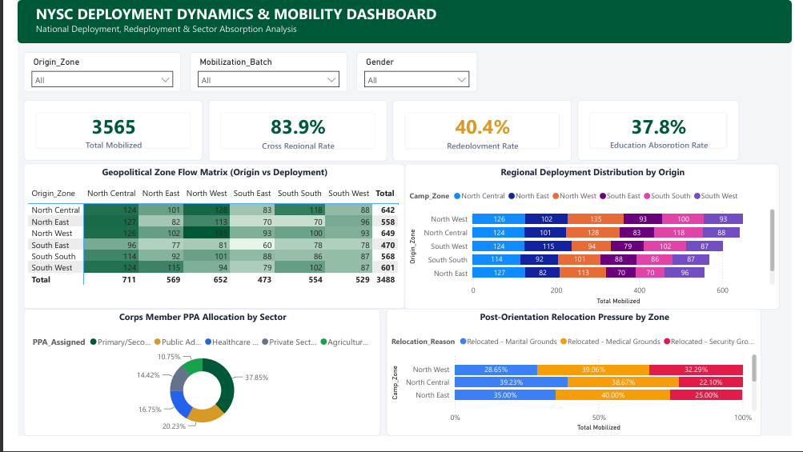
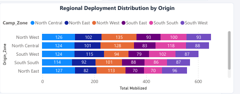

# NYSC Spatial Deployment & Mobility Analysis

## Project Overview

This project analyses the spatial deployment, redeployment, relocation patterns, and sectoral placement of National Youth Service Corps (NYSC) members across Nigeria.

The analysis focuses on understanding how corps members move from their state of origin to their deployment locations, the pressure for post-orientation relocation, redeployment patterns, and the sectors where corps members are absorbed.

The project was developed as part of the **Data Analytics NextGen Cohort** using Microsoft Excel, Power Query, Power BI, and DAX.

---

## Analyst Information

**Analyst:** Helen Joseph  
**Fellow ID:** FE/23/89279176  
**Track:** Data Analytics NextGen Cohort  
**ALC:** Guru Innovation Hub, Cross River State  

---

## Project Title

**NYSC Spatial Deployment Patterns & Redistribution Dynamics**

### Dashboard Title

**NYSC Deployment Dynamics & Mobility Dashboard**

**Subtitle:**  
National Spatial Redistribution, Relocation Friction & PPA Absorption

---

## Problem Statement

NYSC deployment involves moving corps members from their states of origin to different states for national service.

However, deployment patterns can create significant differences between origin locations and final deployment locations. Factors such as distance, security, infrastructure, personal circumstances, and available placement opportunities may contribute to redeployment and relocation requests.

Without analysing these patterns, it can be difficult to identify:

- Major deployment flows between regions
- Areas experiencing high relocation pressure
- Regional differences in redeployment
- How corps members are absorbed across sectors
- Opportunities to improve deployment and placement decisions

This project uses data analytics and visualization to provide a clearer view of these dynamics.

---

## Project Objectives

The main objectives of this project are to:

1. Analyse the geographical distribution of mobilized corps members.
2. Examine movement between geopolitical zones.
3. Identify major deployment and redistribution patterns.
4. Analyse redeployment and relocation trends.
5. Examine corps member absorption across different sectors.
6. Provide data-driven recommendations for improving deployment and placement decisions.

---

## Dataset Overview

The analysis covers **3,565 mobilized corps members** across Nigeria's **36 states and the Federal Capital Territory (FCT)**.

The dataset was analysed and transformed using Excel and Power Query before being visualized in Power BI.

For privacy and responsible data handling, the raw dataset is not included in this repository.

---

## Tools Used

- **Microsoft Excel** – Data inspection and preparation
- **Power Query** – Data cleaning and transformation
- **Microsoft Power BI** – Dashboard development and visualization
- **DAX** – Measures, KPIs, and analytical calculations

---

## Key Performance Indicators

| KPI | Result |
|---|---:|
| Total Mobilized | 3,565 |
| Call-up Rate | 83.9% |
| Redeployment Rate | 40.4% |
| Education Absorption Rate | 37.85% |

These indicators provide a high-level view of mobilization, deployment, redeployment, and sectoral absorption.

---

## Key Findings

### 1. Cross-Regional Deployment

The analysis shows substantial movement of corps members across geopolitical zones.

This demonstrates that NYSC deployment is not restricted to participants' states or regions of origin and creates significant spatial redistribution of young professionals across Nigeria.

### 2. Redeployment

A redeployment rate of **40.4%** indicates that a significant proportion of corps members may require or experience changes to their initial deployment arrangements.

This highlights the importance of understanding the factors influencing deployment satisfaction and relocation.

### 3. Sectoral Absorption

The analysis shows that corps members are absorbed across several sectors, with notable concentration in:

- Education
- Public Administration / MDAs
- Healthcare / Clinical Services
- Private and Financial Services

Education recorded the largest identified sectoral absorption, accounting for approximately **37.85%**.

### 4. Spatial Redistribution

The deployment flow matrix reveals differences between corps members' zones of origin and their deployment zones.

Some regions experience stronger inflows while others record stronger outflows, showing how NYSC contributes to the redistribution of human resources across Nigeria.

### 5. Relocation Pressure

The dashboard highlights differences in post-orientation relocation pressure across geopolitical zones.

This provides an opportunity to investigate the relationship between deployment location, distance, security, infrastructure, and corps member relocation decisions.

---

## Dashboard Features

The Power BI dashboard provides interactive analysis through:

- Geopolitical Zone Flow Matrix
- Origin vs Deployment analysis
- Regional Deployment Distribution
- Sectoral Absorption Analysis
- Post-Orientation Relocation Pressure
- Mobilization Batch filtering
- Gender filtering
- Origin Zone filtering
- KPI cards for major performance indicators

Users can interact with the dashboard to explore deployment patterns from different perspectives.

---

## Business & Policy Insights

The analysis suggests that NYSC deployment can be improved by using historical deployment and redeployment data to support better placement decisions.

Data can help identify locations that consistently experience:

- High redeployment rates
- High relocation pressure
- Low sectoral absorption
- Significant deployment inflows or outflows

This can support a more evidence-based deployment process.

---

## Recommendations

### 1. Use Historical Data for Deployment Planning

Historical deployment and redeployment patterns should be analysed when making future deployment decisions.

### 2. Improve Deployment Matching

Corps members should be matched with PPAs based more closely on their academic discipline, professional skills, and sector requirements.

### 3. Improve Relocation Management

A transparent and data-driven relocation process can help identify legitimate relocation needs while reducing unnecessary movement.

### 4. Strengthen Critical Sectors

Deployment planning should consider areas with shortages in sectors such as education, healthcare, and public administration.

### 5. Consider Security and Infrastructure

Security, road accessibility, distance, and infrastructure should be considered when evaluating deployment locations.

---

## Project Impact

This project demonstrates how data analytics can be used to transform deployment records into actionable insights.

The analysis can help stakeholders better understand:

**Where corps members come from → Where they are deployed → Where they relocate → Where they are absorbed**

This creates a foundation for more informed deployment planning and resource allocation.

---

## Project Deliverables

### Dashboard

The interactive Power BI dashboard presents the major findings and allows users to explore deployment and mobility patterns.

### Dashboard Screenshots

### Project Summary

[View the One-Page Project Summary](Executive_Insight_Summary.pdf)

### Dashboard PDF

[View the Dashboard PDF](NYSC_Deployment_Mobility_Dashboard.pdf.pdf)

